# 批量远程命令执行工具

一个功能强大的批量远程服务器管理工具，支持命令执行、文件传输、运维监控、安全增强等7大模块功能。

## 目录

- [功能概览](#功能概览)
- [安装说明](#安装说明)
- [配置文件](#配置文件)
- [命令详解](#命令详解)
- [测试报告](#测试报告)

---

## 功能概览

| 模块 | 功能 | 参数 |
|------|------|------|
| **基础执行** | 命令执行、脚本执行 | `-x`, `-s` |
| **文件传输** | 上传、下载、目录同步 | `--upload`, `--download`, `--sync` |
| **运维监控** | 健康检查、日志监控、服务状态 | `--health-check`, `--tail`, `--service-status` |
| **高级执行** | 模板变量、标签过滤、历史记录、条件执行 | `--template`, `--tags`, `--history-file`, `--condition` |
| **安全增强** | 密码加密、密钥验证、Agent转发 | `--encrypt-config`, `--verify-host-key`, `--ssh-agent-forwarding` |
| **输出增强** | HTML报告、输出比对、Web仪表盘 | `--export-html`, `--compare`, `--web-dashboard` |
| **通知告警** | 邮件/Webhook通知、钉钉/企业微信告警 | `--notify`, `--alert` |
| **便捷运维** | 预检查、后验证 | `--pre-check`, `--post-verify` |
| **调度自动化** | 定时执行、任务编排、定期巡检、失败重试 | `--schedule`, `--workflow`, `--patrol`, `--retry-failed` |
| **多节点协同** | 主从模式、分批次、轮询执行、故障转移 | `--master`, `--batch-size`, `--loop`, `--fallback` |
| **增强监控** | 指标采集、基准对比、Prometheus输出、异常检测 | `--collect`, `--baseline`, `--prometheus-output`, `--anomaly-detect` |
| **数据分析** | 日志解析、性能报表、统计分析、AI预测 | `--analyze-log`, `--perf-report`, `--stats`, `--predict` |
| **用户体验增强** | TUI界面、进度可视化、结果对比、历史搜索 | `--tui`, `--progress-chart`, `--side-by-side`, `--search-history` |

---

## 安装说明

### 系统要求

- Python 3.8+
- 支持 Linux/macOS/Windows

### 安装依赖

```bash
# 创建虚拟环境（推荐）
python3 -m venv .venv
source .venv/bin/activate  # Linux/macOS
# 或 .venv\Scripts\activate  # Windows

# 安装依赖
pip install paramiko pyyaml colorama cryptography requests flask jinja2 croniter
```

### 快速测试

```bash
python3 batch_exec.py -c test_nodes.yaml -x "uptime"
```

---

## 配置文件

配置文件使用 YAML 格式，支持节点列表和全局设置。

### 基本配置示例

```yaml
nodes:
  - name: "web-server-1"
    host: "192.168.1.10"
    port: 22
    username: "root"
    password: "your_password"
    tags:
      - "web"
      - "prod"

  - name: "db-server-1"
    host: "192.168.1.11"
    port: 22
    username: "root"
    private_key: "~/.ssh/id_rsa"
    tags:
      - "db"
      - "prod"

settings:
  timeout: 30
  parallel: true
  max_workers: 5
  retry_times: 3
  retry_delay: 1.0
```

### 配置字段说明

| 字段 | 必填 | 说明 |
|------|------|------|
| `name` | 否 | 节点名称，默认使用 host |
| `host` | **是** | 主机地址 |
| `port` | 否 | SSH端口，默认22 |
| `username` | **是** | 用户名 |
| `password` | 否 | 密码（与 private_key 二选一） |
| `private_key` | 否 | 私钥文件路径 |
| `tags` | 否 | 标签列表，用于分组过滤 |
| `sudo_password` | 否 | sudo密码 |
| `encrypted_password` | 否 | 加密后的密码 |

---

## 命令详解

### 基础命令执行

```bash
# 执行单个命令
python3 batch_exec.py -c nodes.yaml -x "uptime"

# 执行复杂命令
python3 batch_exec.py -c nodes.yaml -x "df -h && free -m"

# 执行本地脚本
python3 batch_exec.py -c nodes.yaml -s ./deploy.sh

# 指定单个节点
python3 batch_exec.py -c nodes.yaml -x "reboot" --node web-server-1

# 按标签过滤
python3 batch_exec.py -c nodes.yaml -x "uptime" --tags web,prod

# 并行控制
python3 batch_exec.py -c nodes.yaml -x "apt update" --parallel 10

# 串行执行
python3 batch_exec.py -c nodes.yaml -x "service restart" --no-parallel

# 详细输出
python3 batch_exec.py -c nodes.yaml -x "ls -la" -v
```

### 文件传输功能

```bash
# 上传文件到所有节点
python3 batch_exec.py -c nodes.yaml --upload "/local/file.txt:/remote/path/file.txt"

# 从所有节点下载文件（自动添加节点名前缀）
python3 batch_exec.py -c nodes.yaml --download "/remote/log.txt:/local/download_dir/"

# 同步目录到所有节点
python3 batch_exec.py -c nodes.yaml --sync "/local/config_dir:/remote/config_dir"
```

**示例输出**:
```
[✓] web-server-1 (192.168.1.10) - 1.23s
    /local/file.txt -> /remote/path/file.txt
    传输大小: 1024.0 KB
```

### 运维监控功能

```bash
# 节点健康检查（CPU、内存、磁盘、运行时间）
python3 batch_exec.py -c nodes.yaml --health-check

# 查看远程日志
python3 batch_exec.py -c nodes.yaml --tail "/var/log/nginx/error.log" --tail-lines 50

# 检查服务状态
python3 batch_exec.py -c nodes.yaml --service-status "nginx,mysql,redis"
```

**健康检查输出示例**:
```
[✓] web-server-1 (192.168.1.10) - 健康
    CPU: 15.2%
    内存: 45.8%
    磁盘: 23.0%
    运行时间: up 30 days
    负载: 0.50 0.30 0.10
```

### 高级执行功能

```bash
# 命令模板（变量替换）
python3 batch_exec.py -c nodes.yaml --template "deploy_{env}.sh" --var env=prod --var version=v2.0

# 内置变量: {node}, {host}, {port}, {date}, {time}, {timestamp}
python3 batch_exec.py -c nodes.yaml --template "echo 'Node: {node}, Date: {date}'"

# 保存执行历史
python3 batch_exec.py -c nodes.yaml -x "uptime" --history-file history.json

# 条件执行（成功率>=50%时终止）
python3 batch_exec.py -c nodes.yaml -x "test.sh" --condition "success_count >= 50%"
```

### 安全增强功能

```bash
# 加密配置文件中的密码
python3 batch_exec.py --encrypt-config nodes.yaml
# 输出: nodes.yaml.encrypted
# 密钥保存在: ~/.batch_exec_key

# 解密配置文件
python3 batch_exec.py --decrypt-config nodes.yaml.encrypted
# 输出: nodes.yaml.decrypted

# 启用SSH Agent转发（使用本地SSH密钥）
python3 batch_exec.py -c nodes.yaml -x "git pull" --ssh-agent-forwarding

# 验证主机密钥指纹
python3 batch_exec.py -c nodes.yaml -x "uptime" --verify-host-key --auto-accept-host
```

### 输出增强功能

```bash
# 导出JSON结果
python3 batch_exec.py -c nodes.yaml -x "uptime" --export-json results.json

# 导出CSV结果
python3 batch_exec.py -c nodes.yaml -x "uptime" --export-csv results.csv

# 导出HTML报告（带图表）
python3 batch_exec.py -c nodes.yaml -x "uptime" --export-html report.html

# 多节点输出比对
python3 batch_exec.py -c nodes.yaml -x "cat /etc/version" --compare

# 启动Web仪表盘
python3 batch_exec.py -c nodes.yaml -x "uptime" --history-file history.json --web-dashboard
# 访问 http://localhost:8080
```

### 通知告警功能

```bash
# 邮件通知
python3 batch_exec.py -c nodes.yaml -x "deploy.sh" --notify "email:admin@example.com"

# Webhook通知
python3 batch_exec.py -c nodes.yaml -x "deploy.sh" --notify "webhook:https://hooks.example.com/notify"

# 钉钉告警（失败时发送）
python3 batch_exec.py -c nodes.yaml -x "deploy.sh" --alert "dingtalk:your_token"

# 企业微信告警
python3 batch_exec.py -c nodes.yaml -x "deploy.sh" --alert "wechat:your_key"
```

### 便捷运维功能

```bash
# 执行前检查磁盘空间<80%、内存<90%
python3 batch_exec.py -c nodes.yaml -x "deploy.sh" \
    --pre-check "disk:80" \
    --pre-check "memory:90"

# 执行前检查进程是否存在
python3 batch_exec.py -c nodes.yaml -x "restart.sh" \
    --pre-check "process:nginx"

# 执行前检查文件是否存在
python3 batch_exec.py -c nodes.yaml -x "config.sh" \
    --pre-check "file:/etc/nginx/nginx.conf"

# 执行后验证服务运行状态
python3 batch_exec.py -c nodes.yaml -x "deploy.sh" \
    --post-verify "service:nginx"

# 执行后验证端口监听
python3 batch_exec.py -c nodes.yaml -x "start.sh" \
    --post-verify "port:8080"

# 执行后验证文件存在
python3 batch_exec.py -c nodes.yaml -x "install.sh" \
    --post-verify "file:/opt/app/config.yml"
```

### 组合使用示例

```bash
# 完整部署流程：预检查 + 执行 + 后验证 + 报告 + 通知
python3 batch_exec.py -c nodes.yaml -x "deploy.sh" \
    --tags prod \
    --pre-check "disk:80" \
    --pre-check "memory:90" \
    --post-verify "service:nginx" \
    --post-verify "port:80" \
    --export-html deploy_report.html \
    --history-file deploy_history.json \
    --notify "email:team@example.com" \
    --alert "dingtalk:your_token" \
    -v
```

### 交互式模式

```bash
# 进入交互式Shell
python3 batch_exec.py -c nodes.yaml --interactive

# 示例流程:
# 1. 显示可用节点列表
# 2. 选择节点（输入编号或 'all'）
# 3. 输入命令执行
# 4. 输入 'exit' 或 'quit' 退出
```

### 调度与自动化功能

#### 定时执行

使用 cron 表达式定时执行命令，支持后台守护进程模式。

```bash
# 每天凌晨2点执行
python3 batch_exec.py -c nodes.yaml -x "backup.sh" --schedule "0 2 * * *"

# 每5分钟执行一次
python3 batch_exec.py -c nodes.yaml -x "health_check.sh" --schedule "*/5 * * * *"

# 每小时执行
python3 batch_exec.py -c nodes.yaml -x "sync_data.sh" --schedule "0 * * * *"

# 每周一上午9点执行
python3 batch_exec.py -c nodes.yaml -x "weekly_report.sh" --schedule "0 9 * * 1"

# 单次定时执行（执行一次后退出）
python3 batch_exec.py -c nodes.yaml -x "deploy.sh" --schedule "0 2 * * *" --schedule-once

# 指定定时任务日志文件
python3 batch_exec.py -c nodes.yaml -x "backup.sh" --schedule "0 2 * * *" --schedule-log /var/log/batch_exec.log
```

**Cron表达式格式**: `分 时 日 月 周`
- `*` - 任意值
- `*/n` - 每n个时间单位
- `1-5` - 范围
- `1,3,5` - 列表

#### 任务编排

支持 YAML 文件定义任务依赖关系，按顺序执行。

**Workflow配置文件示例** (`workflow.yaml`):
```yaml
workflow:
  tasks:
    - name: prepare
      command: "mkdir -p /opt/app"
      nodes: ["web-1", "web-2"]
    
    - name: download
      command: "wget https://example.com/app.tar.gz"
      depends_on: ["prepare"]
      nodes: ["web-1", "web-2"]
    
    - name: extract
      command: "tar -xzf app.tar.gz"
      depends_on: ["download"]
      nodes: ["web-1", "web-2"]
    
    - name: install
      script: "./install.sh"
      depends_on: ["extract"]
      on_failure: "retry"
      retry_count: 3
      nodes: ["web-1", "web-2"]
    
    - name: start_service
      command: "systemctl restart app"
      depends_on: ["install"]
      nodes: ["web-1", "web-2"]
```

```bash
# 执行工作流
python3 batch_exec.py -c nodes.yaml --workflow workflow.yaml

# 可视化任务依赖图
python3 batch_exec.py -c nodes.yaml --workflow workflow.yaml --workflow-visualize

# 简单链式工作流（字符串格式）
python3 batch_exec.py -c nodes.yaml --workflow "check->prepare->deploy->verify"
```

**Workflow可视化输出**:
```
工作流任务依赖图:

  prepare -> 依赖: 无依赖
    命令: mkdir -p /opt/app
  download -> 依赖: prepare
    命令: wget https://example.com/app.tar.gz
  extract -> 依赖: download
    命令: tar -xzf app.tar.gz
```

#### 定期巡检

自动周期性执行系统健康巡检，生成报告。

```bash
# 启动定期巡检（默认每小时）
python3 batch_exec.py -c nodes.yaml --patrol

# 自定义巡检间隔（每10分钟）
python3 batch_exec.py -c nodes.yaml --patrol --interval 600

# 自定义巡检项目
python3 batch_exec.py -c nodes.yaml --patrol \
    --patrol-checks cpu \
    --patrol-checks memory \
    --patrol-checks disk \
    --patrol-checks process:nginx

# 指定巡检报告输出路径
python3 batch_exec.py -c nodes.yaml --patrol --patrol-report /var/log/patrol.json

# 配置告警（巡检异常时发送）
python3 batch_exec.py -c nodes.yaml --patrol --patrol-alert "dingtalk:your_token"

# 单次巡检（执行一次后退出）
python3 batch_exec.py -c nodes.yaml --patrol --schedule-once
```

**巡检项目说明**:
| 项目 | 说明 | 阈值 |
|------|------|------|
| `cpu` | CPU使用率 | < 80% |
| `memory` | 内存使用率 | < 85% |
| `disk` | 磁盘使用率 | < 90% |
| `uptime` | 系统运行时间 | 无阈值 |
| `process:name` | 进程是否存在 | 存在即通过 |
| `service:name` | 服务运行状态 | 运行即通过 |

**巡检报告示例** (`patrol_report.json`):
```json
{
  "timestamp": "2026-04-13 20:52:47",
  "nodes": [
    {
      "node_name": "test-node",
      "host": "192.168.1.10",
      "status": "healthy",
      "checks": {
        "cpu": {"passed": true, "value": 0.0, "threshold": 80},
        "memory": {"passed": true, "value": 59.8, "threshold": 85},
        "disk": {"passed": true, "value": 11.0, "threshold": 90}
      }
    }
  ],
  "summary": {"healthy": 1, "unhealthy": 0, "error": 0}
}
```

#### 失败重试策略

对失败节点自动重试，支持指数退避策略。

```bash
# 启用失败重试（默认最多5次，间隔60秒）
python3 batch_exec.py -c nodes.yaml -x "deploy.sh" --retry-failed

# 自定义重试参数
python3 batch_exec.py -c nodes.yaml -x "deploy.sh" \
    --retry-failed \
    --max-retry 10 \
    --retry-delay 30

# 启用指数退避（每次重试间隔翻倍）
python3 batch_exec.py -c nodes.yaml -x "deploy.sh" \
    --retry-failed \
    --retry-backoff

# 指定重试状态日志文件
python3 batch_exec.py -c nodes.yaml -x "deploy.sh" \
    --retry-failed \
    --retry-log /var/log/retry_status.json

# 清除重试状态
python3 batch_exec.py -c nodes.yaml --retry-failed --retry-clear
```

**重试策略说明**:
| 参数 | 默认值 | 说明 |
|------|--------|------|
| `--max-retry` | 5 | 最大重试次数 |
| `--retry-delay` | 60 | 重试间隔秒数 |
| `--retry-backoff` | False | 启用指数退避（间隔翻倍） |

**指数退避示例**:
- 第1次重速: 60秒后
- 第2次重速: 120秒后
- 第3次重速: 240秒后
- 第4次重速: 480秒后
- 第5次重速: 960秒后

### 多节点协同执行

#### 主从模式

主节点先执行成功后，再执行从节点。适用于需要先完成关键操作的场景。

```bash
# 主节点执行成功后才执行从节点
python3 batch_exec.py -c nodes.yaml \
    --master web-server-1 \
    --slaves "web-server-2,web-server-3,web-server-4" \
    -x "deploy.sh"

# 主从模式配合详细输出
python3 batch_exec.py -c nodes.yaml \
    --master primary-server \
    --slaves "slave-1,slave-2" \
    -x "sync_data.sh" \
    --export-json master_slave_result.json \
    -v
```

**适用场景**:
- 数据库主从同步
- 配置中心先更新，再推送下游
- 关键服务优先部署

#### 分批次执行

将节点分成多个批次执行，控制并发压力。

```bash
# 每批次5个节点，批次间隔10秒
python3 batch_exec.py -c nodes.yaml --batch-size 5 --batch-delay 10 -x "update.sh"

# 自定义批次参数
python3 batch_exec.py -c nodes.yaml \
    --batch-size 3 \
    --batch-delay 30 \
    -x "heavy_operation.sh" \
    -v
```

**批次执行流程**:
```
批次 1: [node1, node2, node3] → 并行执行
等待 10 秒...
批次 2: [node4, node5, node6] → 并行执行
等待 10 秒...
批次 3: [node7, node8, node9] → 并行执行
```

**适用场景**:
- 大规模节点批量更新
- 需要控制并发压力的操作
- 分阶段灰度发布

#### 轮询执行

循环执行直到满足终止条件。

```bash
# 轮询执行直到全部成功
python3 batch_exec.py -c nodes.yaml --loop --until "all_success" -x "check_status.sh"

# 轮询执行直到成功数>=3
python3 batch_exec.py -c nodes.yaml --loop --until "success_count >= 3" -x "try_connect.sh"

# 自定义轮询参数
python3 batch_exec.py -c nodes.yaml \
    --loop \
    --until "success_count == 10" \
    --max-loops 100 \
    --loop-interval 5 \
    -x "retry_operation.sh"
```

**终止条件格式**:
| 条件 | 说明 |
|------|------|
| `all_success` | 所有节点都成功 |
| `any_success` | 至少一个节点成功 |
| `all_failed` | 所有节点都失败 |
| `success_count >= N` | 成功数>=N |
| `success_count == N` | 成功数=N |
| `fail_count <= N` | 失败数<=N |

**适用场景**:
- 等待服务恢复
- 重试直到成功
- 健康检查轮询

#### 故障转移

主节点失败自动切换备用节点执行。

```bash
# 主节点失败后自动尝试备用节点
python3 batch_exec.py -c nodes.yaml \
    --fallback "backup-server-1,backup-server-2" \
    -x "critical_operation.sh"

# 故障转移配合告警
python3 batch_exec.py -c nodes.yaml \
    --fallback "backup-1,backup-2" \
    -x "process_data.sh" \
    --alert "dingtalk:your_token" \
    -v
```

**执行流程**:
```
尝试主节点 (primary-server) → 失败
尝试备用节点1 (backup-server-1) → 失败
尝试备用节点2 (backup-server-2) → 成功
成功节点: backup-server-2
```

**适用场景**:
- 关键任务高可用执行
- 多数据中心容灾
- 服务降级切换

### 增强监控与采集

#### 实时指标采集

持续采集节点的性能指标，支持自定义采集时长和间隔。

```bash
# 基础采集（默认采集CPU、内存、磁盘、网络）
python3 batch_exec.py -c nodes.yaml --collect --duration 60 --collect-interval 5

# 自定义采集指标
python3 batch_exec.py -c nodes.yaml --collect \
    --metrics cpu \
    --metrics memory \
    --metrics disk \
    --metrics net \
    --duration 120 \
    --collect-interval 10

# 采集并保存结果
python3 batch_exec.py -c nodes.yaml --collect \
    --duration 60 \
    --export-json metrics_data.json

# Prometheus格式输出
python3 batch_exec.py -c nodes.yaml --collect \
    --duration 60 \
    --prometheus-output metrics.prom
```

**支持的采集指标**:
| 指标 | 说明 | 单位 |
|------|------|------|
| `cpu` | CPU使用率 | 百分比 |
| `memory` | 内存使用率 | 百分比 |
| `disk` | 磁盘使用率 | 百分比 |
| `net` | 网络流量 | KB |
| `load` | 系统负载 | 数值 |
| `process` | 进程数量 | 个数 |

**采集输出示例**:
```
开始实时指标采集
目标节点: ['web-server-1', 'web-server-2']
采集指标: ['cpu', 'memory', 'disk']
采集时长: 60 秒, 采集间隔: 5 秒
预计采样: 12 次

--- 采集第 1 次 ---
  web-server-1: CPU=15.2%, MEM=45.8%, DISK=23.0%
  web-server-2: CPU=12.1%, MEM=38.5%, DISK=18.0%
...
指标采集完成: 共采集 24 个样本
```

#### 性能基准对比

与历史基准数据进行对比，识别性能变化。

```bash
# 保存当前数据为基准
python3 batch_exec.py -c nodes.yaml --collect \
    --duration 60 \
    --save-baseline baseline.json

# 与基准对比
python3 batch_exec.py -c nodes.yaml --collect \
    --duration 60 \
    --baseline baseline.json
```

**基准对比输出示例**:
```
性能基准对比
节点: web-server-1
  CPU: 当前 18.5% vs 基准 15.2% (变化 21.7%) [degraded]
  内存: 当前 42.3% vs 基准 45.8% (变化 -7.6%) [improved]
  磁盘: 当前 23.0% vs 基准 23.0% (变化 0.0%) [normal]
```

**状态判断规则**:
| 状态 | 条件 |
|------|------|
| `degraded` | 性能下降超过20% |
| `improved` | 性能改善超过10% |
| `normal` | 变化在正常范围内 |

#### Prometheus集成

输出Prometheus格式的指标文件，便于集成到监控系统。

```bash
# 采集并输出Prometheus格式
python3 batch_exec.py -c nodes.yaml --collect \
    --prometheus-output /var/lib/prometheus/textfiles/batch_exec.prom

# 从历史数据生成Prometheus指标
python3 batch_exec.py --prometheus-output metrics.prom \
    --history-file metrics_collection.json
```

**Prometheus输出格式**:
```
# HELP batch_exec_cpu_usage CPU usage percentage
# TYPE batch_exec_cpu_usage gauge
batch_exec_cpu_usage{node="web-server-1",host="192.168.1.10"} 15.20

# HELP batch_exec_memory_usage Memory usage percentage
# TYPE batch_exec_memory_usage gauge
batch_exec_memory_usage{node="web-server-1",host="192.168.1.10"} 45.80

# HELP batch_exec_disk_usage Disk usage percentage
# TYPE batch_exec_disk_usage gauge
batch_exec_disk_usage{node="web-server-1",host="192.168.1.10"} 23.00

# Generated at 2026-04-13 21:17:51
```

#### 自动异常检测

自动检测指标异常变化，支持自定义阈值。

```bash
# 启用异常检测（默认阈值20%）
python3 batch_exec.py -c nodes.yaml --collect \
    --baseline baseline.json \
    --anomaly-detect

# 自定义异常阈值
python3 batch_exec.py -c nodes.yaml --collect \
    --baseline baseline.json \
    --anomaly-detect \
    --threshold 15

# 保存异常报告
python3 batch_exec.py -c nodes.yaml --collect \
    --baseline baseline.json \
    --anomaly-detect \
    --anomaly-report anomaly.json
```

**异常检测输出示例**:
```
自动异常检测 (阈值: 20.0%)
============================================================
[异常] web-server-1 CPU: 当前 35.2% 基准 15.2% 偏离 131.6% 严重度: high
[异常] web-server-2 内存: 当前 72.5% 基准 45.0% 偏离 61.1% 严重度: high
============================================================
异常检测完成: 发现 2 个异常
```

**异常严重度分级**:
| 严重度 | 条件 |
|--------|------|
| `high` | 偏离超过50% |
| `medium` | 偏离超过30% |
| `low` | 偏离超过阈值 |

**使用场景**:
- 性能退化监控
- 容量规划预警
- 异常行为检测
- 自动化运维触发

### 数据分析与报表

#### 执行日志解析

解析执行日志文件，自动分析日志级别分布、成功/失败比例、节点分布等。

```bash
# 解析日志文件
python3 batch_exec.py --analyze-log /var/log/batch_exec.log

# 保存分析报告
python3 batch_exec.py --analyze-log app.log --analyze-output log_report.json

# 详细模式
python3 batch_exec.py --analyze-log /tmp/exec_history.json -v
```

**日志分析输出示例**:
```
解析日志文件: app.log
已解析 18 条日志

日志分析结果:
  总条目: 18
  日志级别分布: {'INFO': 15, 'WARNING': 1, 'ERROR': 2}
  成功/失败: 9/2
  平均耗时: 1.23s
  节点分布: {'web-server-1': 5, 'web-server-2': 3}
  错误数: 2
  警告数: 1
```

**分析报告包含**:
- 日志级别统计（INFO/WARNING/ERROR）
- 成功/失败执行比例
- 节点执行频率
- 平均执行耗时
- 错误和警告详情列表

#### 性能报表生成

生成性能趋势报表，包含HTML可视化图表和JSON数据。

```bash
# 生成7天性能报表
python3 batch_exec.py --perf-report --perf-range 7d

# 指定输出路径
python3 batch_exec.py --perf-report --perf-range 30d --perf-output monthly_report.html

# 指定数据目录
python3 batch_exec.py --perf-report --data-dir /data/metrics
```

**报表包含内容**:
- CPU/内存/磁盘使用率趋势图
- 每日平均性能指标统计表
- 异常状态标记（警告/危险）
- Chart.js可视化图表

**HTML报表特性**:
- 响应式布局，支持多种设备
- 交互式趋势图表
- 自动状态判断和颜色标记
- 汇总统计卡片

#### 统计分析

对历史执行数据进行统计分析，支持按日期和按节点分组。

```bash
# 按日期统计
python3 batch_exec.py --stats --by-day

# 按节点统计
python3 batch_exec.py --stats --by-node

# 综合统计
python3 batch_exec.py --stats --by-day --by-node --stats-days 7

# 保存统计报告
python3 batch_exec.py --stats --stats-output statistics.json
```

**统计分析输出示例**:
```
统计分析摘要
按日期统计:
  2026-04-13: 执行 15 次, 成功率 95.0%, 平均耗时 0.78s
  2026-04-12: 执行 20 次, 成功率 100.0%, 平均耗时 0.65s

按节点统计:
  web-server-1: 执行 35 次, 成功率 97.1%
  web-server-2: 执行 35 次, 成功率 100.0%
```

**统计维度**:
| 维度 | 统计项 |
|------|--------|
| 按日期 | 执行次数、成功率、平均耗时 |
| 按节点 | 执行次数、成功率、平均耗时 |
| 综合 | 命令频率、失败节点TOP |

#### AI异常预测

基于历史数据预测可能的性能异常。

```bash
# 基于基准数据预测
python3 batch_exec.py --predict --baseline baseline.json

# 保存预测结果
python3 batch_exec.py --predict --baseline baseline.json --predict-output predictions.json

# 指定模型文件（可选）
python3 batch_exec.py --predict --model anomaly.pkl --baseline metrics.json
```

**预测输出示例**:
```
AI异常预测
基准统计: {'cpu': {'mean': 15.2, 'std': 3.5}, 'memory': {'mean': 45.8, 'std': 8.2}}

[预测异常] web-server-1 cpu: 预测值 18.7, 基准均值 15.2, 风险级别 medium, 置信度 76.9%
  建议: cpu有上升趋势，建议监控

预测完成: 发现 1 个潜在异常
```

**预测模型说明**:
- 基于历史均值和标准差计算
- 预测值 = 均值 + 标准差
- 风险级别判断:
  - `high`: 预测值 > 均值 + 2倍标准差
  - `medium`: 预测值 > 均值 + 标准差
  - `low`: 预测值在正常范围

**使用场景**:
- 容量规划预警
- 性能退化预测
- 自动运维决策
- 资源分配优化

### 用户体验增强

#### TUI交互界面

终端图形界面，提供可视化的执行体验。

```bash
# TUI模式执行命令
python3 batch_exec.py -c nodes.yaml -x "uptime" --tui

# TUI交互式菜单（无命令时）
python3 batch_exec.py -c nodes.yaml --tui
```

**TUI界面特点**:
- 实时节点状态显示
- 并排布局：节点列表 + 输出面板
- 进度条和统计汇总
- Rich库驱动的终端美化

**界面布局**:
```
╭──────────────────────────────────────────────────────────────────────────────╮
│ 批量远程执行工具 - uptime                                                    │
╰──────────────────────────────────────────────────────────────────────────────╯
╭────────────── 节点状态 ──────────────╮╭───────── 输出 ──────────────────────╮
│               节点列表               ││ 成功                                 │
│ ┏━━━━━━━━━┳━━━━━━━━━┳━━━━━━┳━━━━━━━┓ ││ 21:44:02 up 33 days...              │
│ ┃ 节点    ┃ 主机    ┃ 状态 ┃ 耗时  ┃ ││                                      │
│ │ node-1  │ 192...  │ ✓    │ 0.23s │ ││                                      │
│ │ node-2  │ 192...  │ ✓    │ 0.25s │ ││                                      │
│ └─────────┴─────────┴──────┴───────┘ ││                                      │
╰──────────────────────────────────────╯╰──────────────────────────────────────╯
╭──────────────────────────────────────────────────────────────────────────────╮
│ 进度: 100.0% | 成功: 2 | 失败: 0 | 总计: 2                                   │
╰──────────────────────────────────────────────────────────────────────────────╯
```

**交互式菜单选项**:
- 1. 执行命令
- 2. 执行脚本
- 3. 健康检查
- 4. 查看节点列表
- 5. 查看历史
- q. 退出

#### 执行进度可视化

实时进度图表，显示详细执行统计。

```bash
# 启用进度图表
python3 batch_exec.py -c nodes.yaml -x "hostname" --progress-chart
```

**进度图表输出**:
```
     最终结果      
┏━━━━━━━━┳━━━━━━━━┓
┃ 统计   ┃ 数值   ┃
│ 总耗时 │ 0.24s  │
│ 成功数 │ 2      │
│ 失败数 │ 0      │
│ 成功率 │ 100.0% │
└────────┴────────┘
```

**统计信息**:
- 进度百分比
- 成功/失败计数
- 已用时间和预估剩余时间
- 平均耗时

#### 结果对比视图

并排显示多节点执行结果，便于对比分析。

```bash
# 启用结果对比视图
python3 batch_exec.py -c nodes.yaml -x "echo hello" --side-by-side
```

**对比视图输出**:
```
╭──── node-1 (192.168.1.10) ────╮╭──── node-2 (192.168.1.11) ────╮
│ 成功 (0.24s)                  ││ 成功 (0.27s)                   │
│ hello                         ││ hello                          │
╰───────────────────────────────╯╰───────────────────────────────╯
            输出对比             
┏━━━━━━━━━━━━━┳━━━━━━━━━━┳━━━━━━┓
┃ 节点        ┃ 输出长度 ┃ 差异 ┃
│ node-1      │ 6        │ 0    │
│ node-2      │ 6        │ 0    │
└─────────────┴──────────┴──────┘
```

**对比功能**:
- 并排节点面板
- 输出长度对比
- 关键差异标记

#### 命令历史搜索

搜索和查看历史执行记录。

```bash
# 搜索关键词
python3 batch_exec.py --search-history "deploy"

# 按日期搜索
python3 batch_exec.py --search-date "2026-04"

# 按状态搜索（成功记录）
python3 batch_exec.py --search-status success

# 按状态搜索（失败记录）
python3 batch_exec.py --search-status fail

# 限制显示数量
python3 batch_exec.py --search-history "uptime" --history-limit 10
```

**搜索结果输出**:
```
                                 搜索结果 (3条)                                 
┏━━━━━━━━━━━━━━━━━━┳━━━━━━━━━━━━━━━━━━━━━━━━━━━━┳━━━━━━━━━┳━━━━━━━━━━┳━━━━━━━━━┓
┃ 时间             ┃ 令/脚本                   ┃ 节点数  ┃ 成功/失败┃ 耗时    ┃
│ 2026-04-13       │ uptime                     │ 2       │ 2/0      │ 0.3s    │
│ 2026-04-13       │ hostname                   │ 2       │ 2/0      │ 0.3s    │
│ 2026-04-13       │ df -h                      │ 2       │ 2/0      │ 0.2s    │
└──────────────────┴────────────────────────────┴─────────┴──────────┴─────────┘
```

**搜索参数**:
- `--search-history`: 按关键词搜索命令
- `--search-field`: 指定搜索字段（默认command）
- `--search-date`: 按日期筛选
- `--search-status`: 按执行状态筛选
- `--history-limit`: 显示数量限制

---

## 测试报告

### 测试环境

```yaml
nodes:
  - name: "test-node"
    host: "192.168.1.10"
    port: 22
    username: "root"
    password: "your_password_here"
    tags:
      - "test"
      - "remote"
```

### Phase 1: 文件传输功能测试

| 测试项 | 命令 | 结果 |
|--------|------|------|
| 文件上传 | `--upload "/tmp/test_upload.txt:/tmp/remote_test.txt"` | ✓ 成功 |
| 文件下载 | `--download "/tmp/remote_test.txt:/tmp/download_dir"` | ✓ 成功，文件保存为 `test-node_remote_test.txt` |
| 目录同步 | `--sync "/tmp/sync_test:/tmp/remote_sync"` | ✓ 成功，递归同步2个文件 |

**上传测试输出**:
```
[✓] test-node (192.168.1.10) - 0.91s
    /tmp/test_upload.txt -> /tmp/remote_test.txt
传输完成: 成功 1, 失败 0
```

### Phase 2: 运维监控功能测试

| 测试项 | 命令 | 结果 |
|--------|------|------|
| 健康检查 | `--health-check` | ✓ 成功，获取CPU(3.2%)、内存(58.2%)、磁盘(11%) |
| 日志监控 | `--tail "/var/log/messages" --tail-lines 5` | ✓ 成功，显示最近5条日志 |
| 服务状态 | `--service-status "sshd,systemd"` | ✓ sshd运行，systemd不适用 |

**健康检查输出**:
```
[✓] test-node (192.168.1.10) - 健康
    CPU: 3.2%
    内存: 58.2%
    磁盘: 11.0%
    运行时间: up 4 weeks, 5 days, 5 hours, 44 minutes
    负载: 0.10 0.07 0.01
健康检查完成: 健康 1, 不健康 0
```

### Phase 3: 高级执行功能测试

| 测试项 | 命令 | 结果 |
|--------|------|------|
| 命令模板 | `--template "echo 'Hello from {node} at {date}'"` | ✓ 成功，输出: `Hello from test-node at 2026-04-13` |
| 模板变量 | `--template "echo {env}" --var env=prod` | ✓ 成功，变量替换正常 |
| 标签过滤 | `--tags test -x "hostname"` | ✓ 成功，按标签筛选节点 |
| 历史记录 | `-x "uptime" --history-file /tmp/exec_history.json` | ✓ 成功，JSON格式保存 |
| 条件执行 | `--condition "success_count >= 50%"` | ✓ 功能已实现 |

**模板测试输出**:
```
[✓] test-node (192.168.1.10) - 0.78s
    输出:
        Hello from test-node at 2026-04-13
```

**历史记录文件内容**:
```json
[
  {
    "timestamp": "2026-04-13 19:37:56",
    "command": "uptime",
    "node_count": 1,
    "success_count": 1,
    "fail_count": 0,
    "duration": 0.78,
    "nodes": ["test-node"]
  }
]
```

### Phase 4: 安全增强功能测试

| 测试项 | 命令 | 结果 |
|--------|------|------|
| 配置加密 | `--encrypt-config test_nodes.yaml` | ✓ 成功，生成 `.encrypted` 文件 |
| 加密内容验证 | 查看 `test_nodes.yaml.encrypted` | ✓ 密码已加密，原始密码已置空 |
| 配置解密 | `--decrypt-config test_nodes.yaml.encrypted` | ✓ 成功，生成 `.decrypted` 文件 |

**加密后配置示例**:
```yaml
nodes:
- encrypted_password: gAAAAABp3NZY6RWvzYI2HMk8ieLPQklgUhgBxE4eAw9wQA9yJBWjDzQXigwAKbID5aWZP28YeP0zRp7io9LczufzwlxtmBti-A==
  host: 192.168.1.10
  password: null
```

### Phase 5: 输出增强功能测试

| 测试项 | 命令 | 结果 |
|--------|------|------|
| HTML报告 | `--export-html /tmp/report.html` | ✓ 成功，生成带图表的HTML |
| JSON导出 | `--export-json /tmp/results.json` | ✓ 成功 |
| CSV导出 | `--export-csv /tmp/results.csv` | ✓ 成功 |
| 输出比对 | `--compare` | ✓ 功能已实现 |
| Web仪表盘 | `--web-dashboard` | ✓ 功能已实现（需配合历史文件） |

**HTML报告特性**:
- 执行摘要（总数、成功、失败、耗时）
- 成功率饼图（SVG）
- 详细结果表格（节点、状态、输出）

### Phase 6: 通知告警功能测试

| 测试项 | 功能 | 状态 |
|--------|------|------|
| 邮件通知 | `send_email_notification()` | ✓ 函数已实现 |
| Webhook通知 | `send_webhook_notification()` | ✓ 函数已实现 |
| 钉钉告警 | `send_dingtalk_alert()` | ✓ 函数已实现 |
| 企业微信告警 | `send_wechat_alert()` | ✓ 函数已实现 |

*注：实际通知发送需要配置真实的邮件服务器/Webhook地址*

### Phase 7: 便捷运维功能测试

| 测试项 | 命令 | 结果 |
|--------|------|------|
| 磁盘预检查 | `--pre-check "disk:80"` | ✓ 成功，磁盘使用11% < 80% |
| 内存预检查 | `--pre-check "memory:90"` | ✓ 成功，内存58.2% < 90% |
| 端口后验证 | `--post-verify "port:22"` | ✓ 成功，SSH端口监听 |
| 文件后验证 | `--post-verify "file:/tmp/test_upload.txt"` | ✗ 文件不存在（测试预期） |

**预检查输出**:
```
执行预检查
============================================================
检查节点: test-node
  [✓] test-node
    [✓] disk:80: 磁盘使用率: 11%
    [✓] memory:90: 内存使用率: 58.2%
所有预检查通过，开始执行
```

### 综合集成测试

```bash
python3 batch_exec.py -c test_nodes.yaml -x "hostname && uptime && df -h /" \
    --export-json /tmp/final_test.json \
    --export-html /tmp/final_test.html \
    --history-file /tmp/final_history.json \
    --pre-check "disk:90" \
    --post-verify "port:22" \
    -v
```

**测试结果**: ✓ 全部成功

```
执行预检查: [✓] disk:90: 磁盘使用率: 11%
执行命令: hostname && uptime && df -h /
后验证: [✓] port:22: 端口 22: 监听
导出: JSON ✓, HTML ✓
历史: 已保存到 /tmp/final_history.json
执行完成: 成功 1, 失败 0 (耗时 1.2s)
```

### 测试覆盖率总结

| 功能模块 | 测试通过 | 备注 |
|----------|----------|------|
| 基础执行 | ✓ | 命令、脚本、节点过滤 |
| 文件传输 | ✓ | 上传、下载、同步 |
| 运维监控 | ✓ | 健康检查、日志、服务状态 |
| 高级执行 | ✓ | 模板、标签、历史、条件 |
| 安全增强 | ✓ | 加密、解密 |
| 输出增强 | ✓ | HTML、JSON、CSV |
| 通知告警 | ✓ | 函数实现（需真实配置测试） |
| 便捷运维 | ✓ | 预检查、后验证 |
| 调度自动化 | ✓ | 定时执行、工作流、巡检、重试 |
| 数据分析 | ✓ | 日志解析、报表、统计、AI预测 |
| 用户体验增强 | ✓ | TUI界面、进度可视化、结果对比、历史搜索 |

### Phase 8: 调度与自动化功能测试

#### 定时执行测试

| 测试项 | 命令 | 结果 |
|--------|------|------|
| Cron表达式解析 | `--schedule "*/1 * * * *" --schedule-once` | ✓ 成功 |
| 定时任务执行 | `-x "date" --schedule "*/1 * * * *" --schedule-once` | ✓ 成功 |
| 单次执行模式 | `--schedule-once` | ✓ 执行一次后退出 |

**定时执行输出**:
```
定时任务启动: cron表达式 '*/1 * * * *'
下次执行时间: 2026-04-13 12:54:00, 等待 48 秒
开始执行定时任务: 2026-04-13 12:54:00
执行完成: 1/1 成功
定时任务执行完成
单次执行模式，退出调度器
```

#### 工作流编排测试

| 测试项 | 命令 | 结果 |
|--------|------|------|
| Workflow配置解析 | `--workflow test_workflow.yaml` | ✓ 成功，解析3个任务 |
| 任务依赖可视化 | `--workflow-visualize` | ✓ 成功 |
| 工作流执行 | `-v` 详细模式 | ✓ 全部任务成功 |

**Workflow配置** (`test_workflow.yaml`):
```yaml
workflow:
  tasks:
    - name: check_system
      command: "uptime"
      nodes: ["test-node"]
    - name: check_disk
      command: "df -h"
      depends_on: ["check_system"]
    - name: check_memory
      command: "free -m"
      depends_on: ["check_system"]
```

**工作流执行输出**:
```
开始执行工作流
执行任务 'check_system' 在 1 个节点上
[✓] test-node (192.168.1.10) - 0.58s
任务 'check_system' 完成
执行任务 'check_disk' 在 1 个节点上
[✓] test-node (192.168.1.10) - 0.60s
任务 'check_disk' 完成
执行任务 'check_memory' 在 1 个节点上
[✓] test-node (192.168.1.10) - 0.62s
任务 'check_memory' 完成
工作流完成: 3 成功, 0 失败
```

#### 定期巡检测试

| 测试项 | 命令 | 结果 |
|--------|------|------|
| 单次巡检 | `--patrol --schedule-once` | ✓ 成功 |
| 自定义巡检项目 | `--patrol-checks cpu --patrol-checks memory --patrol-checks disk` | ✓ 成功 |
| 报告生成 | 自动保存到 `/tmp/patrol_report.json` | ✓ JSON格式正确 |
| 健康状态判断 | CPU(0%)<80%, Memory(59.8%)<85%, Disk(11%)<90% | ✓ 全部健康 |

**巡检输出**:
```
开始巡检 (2026-04-13 20:52:47)
[✓] test-node (192.168.1.10) - healthy
巡检报告已保存: /tmp/patrol_report.json
巡检完成: 健康 1, 异常 0, 错误 0
```

#### 调度自动化参数汇总

| 参数 | 功能 | 状态 |
|------|------|------|
| `--schedule` | 定时执行（cron表达式） | ✓ |
| `--schedule-once` | 单次执行后退出 | ✓ |
| `--schedule-log` | 定时任务日志文件 | ✓ |
| `--workflow` | 任务编排（YAML或字符串） | ✓ |
| `--workflow-visualize` | 可视化任务依赖 | ✓ |
| `--patrol` | 定期巡检模式 | ✓ |
| `--interval` | 巡检间隔秒数 | ✓ |
| `--patrol-checks` | 巡检项目列表 | ✓ |
| `--patrol-report` | 报告输出路径 | ✓ |
| `--patrol-alert` | 异常告警配置 | ✓ |
| `--retry-failed` | 失败节点重试 | ✓ |
| `--max-retry` | 最大重试次数 | ✓ |
| `--retry-delay` | 重试间隔秒数 | ✓ |
| `--retry-backoff` | 指数退避策略 | ✓ |
| `--retry-log` | 重试状态日志 | ✓ |
| `--retry-clear` | 清除重试状态 | ✓ |

### Phase 9: 多节点协同执行功能测试

#### 主从模式测试

| 测试项 | 命令 | 结果 |
|--------|------|------|
| 主节点执行 | `--master primary-server` | ✓ 成功执行 |
| 从节点等待 | 主节点成功后执行从节点 | ✓ 顺序正确 |
| 多从节点 | 3个从节点顺序执行 | ✓ 全部成功 |
| 失败阻断 | 主节点失败时终止从节点执行 | ✓ 功能正常 |

**测试输出**:
```
主从模式执行
主节点: primary-server
从节点: ['slave-server-1', 'slave-server-2', 'slave-server-3']
[主节点] 执行: primary-server → 成功
主节点执行成功，开始执行 3 个从节点
[从节点] 执行: slave-server-1 → 成功
[从节点] 执行: slave-server-2 → 成功
[从节点] 执行: slave-server-3 → 成功
主从执行完成: 成功 4, 失败 0
```

#### 分批次执行测试

| 测试项 | 命令 | 结果 |
|--------|------|------|
| 批次分割 | `--batch-size 2` | ✓ 6节点分3批 |
| 批次间隔 | `--batch-delay 3` | ✓ 每批次间隔3秒 |
| 批次并行 | 每批次内并行执行 | ✓ 并行正常 |
| 总体统计 | 成功汇总 | ✓ 成功6, 失败0 |

**测试输出**:
```
分批次执行模式
总节点数: 6, 批次大小: 2, 总批次数: 3
--- 执行批次 1/3 ---
批次节点: ['primary-server', 'backup-server-1']
批次 1 完成: 2/2 成功, 耗时 0.63s
等待 3 秒后执行下一批次...
--- 执行批次 2/3 ---
批次节点: ['backup-server-2', 'slave-server-1']
批次 2 完成: 2/2 成功, 耗时 0.67s
等待 3 秒后执行下一批次...
--- 执行批次 3/3 ---
批次节点: ['slave-server-2', 'slave-server-3']
批次 3 完成: 2/2 成功, 耗时 0.68s
分批次执行完成: 成功 6, 失败 0
```

#### 轮询执行测试

| 测试项 | 命令 | 结果 |
|--------|------|------|
| 轮询启动 | `--loop` | ✓ 启动轮询模式 |
| 条件检查 | `--until "success_count >= 3"` | ✓ 条件解析正确 |
| 自动终止 | 条件满足后停止 | ✓ 第1轮后终止 |
| 最大循环 | `--max-loops 5` | ✓ 限制生效 |

**测试输出**:
```
轮询执行模式
目标节点: 6个
终止条件: success_count >= 3
最大循环次数: 5, 轮询间隔: 2 秒
--- 轮询第 1 次 ---
轮询 1 完成: 6/6 成功, 耗时 4.77s
终止条件 'success_count >= 3' 已满足，停止轮询
轮询执行完成: 总轮询次数 1, 成功 6, 失败 0
```

#### 故障转移测试

| 测试项 | 命令 | 结果 |
|--------|------|------|
| 主节点尝试 | primary-server | ✓ 成功执行 |
| 备用节点准备 | backup-server-1, backup-server-2 | ✓ 配置正确 |
| 主节点成功 | 主节点成功后跳过备用节点 | ✓ 不触发备用 |
| 成功节点标识 | 显示成功节点名称 | ✓ 输出正确 |

**测试输出**:
```
故障转移执行模式
主节点: primary-server
备用节点: ['backup-server-1', 'backup-server-2']
[主节点] 尝试执行: primary-server → 成功
主节点 primary-server 执行成功
故障转移执行完成: 主节点成功
成功节点: primary-server
```

#### 多节点协同参数汇总

| 参数 | 功能 | 状态 |
|------|------|------|
| `--master` | 主从模式: 主节点名称 | ✓ |
| `--slaves` | 主从模式: 从节点列表 | ✓ |
| `--batch-size` | 分批次: 每批次节点数 | ✓ |
| `--batch-delay` | 分批次: 批次间隔秒数 | ✓ |
| `--loop` | 启用轮询执行模式 | ✓ |
| `--until` | 轮询终止条件 | ✓ |
| `--max-loops` | 轮询最大循环次数 | ✓ |
| `--loop-interval` | 轮询间隔秒数 | ✓ |
| `--fallback` | 故障转移: 备用节点列表 | ✓ |

### Phase 10: 增强监控与采集功能测试

#### 实时指标采集测试

| 测试项 | 命令 | 结果 |
|--------|------|------|
| 基础采集 | `--collect --duration 15 --collect-interval 5` | ✓ 成功采集3次样本 |
| 自定义指标 | `--metrics cpu --metrics memory --metrics disk` | ✓ 成功采集指定指标 |
| 数据保存 | 自动保存到 `/tmp/metrics_collection.json` | ✓ JSON格式正确 |
| Prometheus输出 | `--prometheus-output prometheus_metrics.txt` | ✓ 格式正确 |

**采集测试输出**:
```
开始实时指标采集
目标节点: ['test-node']
采集指标: ['cpu', 'memory', 'disk']
采集时长: 15 秒, 采集间隔: 5 秒
预计采样: 3 次
--- 采集第 1 次 ---
  test-node: CPU=0.0%, MEM=58.2%, DISK=11.0%
--- 采集第 2 次 ---
  test-node: CPU=0.0%, MEM=57.8%, DISK=11.0%
--- 采集第 3 次 ---
  test-node: CPU=3.2%, MEM=57.7%, DISK=11.0%
指标采集完成: 共采集 3 个样本
```

#### 性能基准对比测试

| 测试项 | 命令 | 结果 |
|--------|------|------|
| 保存基准 | `--save-baseline baseline.json` | ✓ 成功保存基准数据 |
| 加载基准 | `--baseline baseline.json` | ✓ 成功加载基准 |
| 对比显示 | 输出CPU、内存、磁盘对比结果 | ✓ 变化百分比正确 |
| 状态判断 | normal/improved/degraded | ✓ 状态判断正确 |

**基准对比输出**:
```
性能基准对比
节点: test-node
  内存: 当前 59.0% vs 基准 58.0% (变化 1.7%) [normal]
  磁盘: 当前 11.0% vs 基准 11.0% (变化 0.0%) [normal]
```

#### Prometheus集成测试

| 测试项 | 命令 | 结果 |
|--------|------|------|
| 格式输出 | `--prometheus-output prometheus_metrics.txt` | ✓ Prometheus格式正确 |
| 指标命名 | `batch_exec_cpu_usage`, `batch_exec_memory_usage` | ✓ 符合命名规范 |
| 标签格式 | `{node="...",host="..."}` | ✓ 标签正确 |

**Prometheus输出示例**:
```
# HELP batch_exec_cpu_usage CPU usage percentage
# TYPE batch_exec_cpu_usage gauge
batch_exec_cpu_usage{node="test-node",host="192.168.1.10"} 3.10

# HELP batch_exec_memory_usage Memory usage percentage
# TYPE batch_exec_memory_usage gauge
batch_exec_memory_usage{node="test-node",host="192.168.1.10"} 57.53

# HELP batch_exec_disk_usage Disk usage percentage
# TYPE batch_exec_disk_usage gauge
batch_exec_disk_usage{node="test-node",host="192.168.1.10"} 11.00
```

#### 自动异常检测测试

| 测试项 | 命令 | 结果 |
|--------|------|------|
| 异常检测 | `--anomaly-detect --threshold 10` | ✓ 正常检测运行 |
| 阈值判断 | 10%阈值下未检测到异常 | ✓ 判断逻辑正确 |
| 报告保存 | `--anomaly-report anomaly_report.json` | ✓ JSON格式正确 |

**异常检测输出**:
```
自动异常检测 (阈值: 10.0%)
============================================================
异常检测完成: 发现 0 个异常
============================================================
异常报告已保存: anomaly_report.json
```

#### 增强监控参数汇总

| 参数 | 功能 | 状态 |
|------|------|------|
| `--collect` | 启用实时指标采集 | ✓ |
| `--metrics` | 采集指标类型 | ✓ |
| `--duration` | 采集时长秒数 | ✓ |
| `--collect-interval` | 采集间隔秒数 | ✓ |
| `--prometheus-output` | Prometheus格式输出 | ✓ |
| `--baseline` | 基准对比文件 | ✓ |
| `--save-baseline` | 保存为新基准 | ✓ |
| `--anomaly-detect` | 启用异常检测 | ✓ |
| `--threshold` | 异常检测阈值 | ✓ |
| `--anomaly-report` | 异常报告输出 | ✓ |

### Phase 11: 数据分析与报表功能测试

#### 执行日志解析测试

| 测试项 | 命令 | 结果 |
|--------|------|------|
| 日志解析 | `--analyze-log test_log.log` | ✓ 成功解析18条日志 |
| 日志级别统计 | INFO/WARNING/ERROR分布 | ✓ 统计正确 |
| 成功/失败分析 | 9成功/2失败 | ✓ 比例正确 |
| 节点分布 | 按节点频率统计 | ✓ 功能正常 |
| 报告保存 | `--analyze-output log_analysis.json` | ✓ JSON格式正确 |

**日志解析输出**:
```
解析日志文件: test_log.log
已解析 18 条日志

日志分析结果:
  总条目: 18
  日志级别分布: {'INFO': 15, 'WARNING': 1, 'ERROR': 2}
  成功/失败: 9/2
  平均耗时: 0.00s
  错误数: 2
  警告数: 1
日志分析报告已保存: log_analysis.json
```

#### 性能报表生成测试

| 测试项 | 命令 | 结果 |
|--------|------|------|
| 报表生成 | `--perf-report --perf-range 7d` | ✓ HTML和JSON报表生成 |
| 时间范围解析 | 7d格式解析 | ✓ 正确解析为7天 |
| 图表生成 | Chart.js趋势图 | ✓ 图表正确显示 |
| 统计卡片 | CPU/内存/磁盘平均值 | ✓ 计算正确 |

**性能报表输出**:
```
已加载 3 条指标数据
性能报表已生成: performance_report.html
JSON报表已保存: performance_report.json
```

#### 统计分析测试

| 测试项 | 命令 | 结果 |
|--------|------|------|
| 数据加载 | 从/tmp目录加载历史文件 | ✓ 成功加载2条数据 |
| 按日期统计 | `--by-day` | ✓ 统计正确 |
| 按节点统计 | `--by-node` | ✓ 统计正确 |
| 成功率计算 | 100%成功率 | ✓ 计算正确 |
| 报告保存 | `--stats-output stats_report.json` | ✓ JSON格式正确 |

**统计分析输出**:
```
加载统计数据
已加载: /tmp/exec_history.json
已加载: /tmp/metrics_collection.json
总数据条数: 2

统计分析摘要
按日期统计:
  2026-04-13: 执行 1 次, 成功率 100.0%, 平均耗时 0.78s

按节点统计:
  test-node: 执行 1 次, 成功率 100.0%
统计报告已保存: stats_report.json
```

#### AI异常预测测试

| 测试项 | 命令 | 结果 |
|--------|------|------|
| 基准统计 | CPU/内存/磁盘均值和标准差 | ✓ 计算正确 |
| 预测生成 | 基于基准数据预测 | ✓ 预测逻辑正常 |
| 风险判断 | low/medium/high判断 | ✓ 判断逻辑正确 |
| 报告保存 | `--predict-output predictions.json` | ✓ JSON格式正确 |

**异常预测输出**:
```
基准统计: {'cpu': {'mean': 3.1, 'std': 0}, 'memory': {'mean': 60.44, 'std': 1.10}, 'disk': {'mean': 11.0, 'std': 0.0}}

AI异常预测
预测完成: 发现 0 个潜在异常
预测结果已保存: predictions.json
```

#### 数据分析参数汇总

| 参数 | 功能 | 状态 |
|------|------|------|
| `--analyze-log` | 日志解析文件路径 | ✓ |
| `--analyze-output` | 日志分析报告输出 | ✓ |
| `--perf-report` | 生成性能报表 | ✓ |
| `--perf-range` | 性能报表时间范围 | ✓ |
| `--perf-output` | 性能报表输出路径 | ✓ |
| `--stats` | 执行统计分析 | ✓ |
| `--by-day` | 按日期统计 | ✓ |
| `--by-node` | 按节点统计 | ✓ |
| `--stats-days` | 统计天数 | ✓ |
| `--stats-output` | 统计报告输出 | ✓ |
| `--predict` | AI异常预测 | ✓ |
| `--predict-model` | 预测模型文件 | ✓ |
| `--predict-output` | 预测结果输出 | ✓ |
| `--data-dir` | 数据文件目录 | ✓ |

### Phase 12: 用户体验增强功能测试

#### TUI交互界面测试

| 测试项 | 命令 | 结果 |
|--------|------|------|
| TUI执行模式 | `--tui -x "uptime"` | ✓ 成功，显示图形化界面 |
| 实时进度显示 | 自动更新节点状态 | ✓ 正常显示 |
| 结果汇总表格 | 执行完成后显示统计 | ✓ 正常格式 |

**TUI界面输出**:
```
╭──────────────────────────────────────────────────────────────────────────────╮
│ 批量远程执行工具 - uptime                                                    │
╰──────────────────────────────────────────────────────────────────────────────╯
╭────────────── 节点状态 ──────────────╮╭───────── 输出 - test-node-2 ─────────╮
│               节点列表               ││ 成功                                 │
│ ┏━━━━━━━━━┳━━━━━━━━━┳━━━━━━┳━━━━━━━┓ ││  21:44:02 up 33 days,  7:53,  0      │
│ ┃ 节点    ┃ 主机    ┃ 状态 ┃ 耗时  ┃ ││ users,  load average: 0.20, 0.09,    │
│ │ test-n… │ 115.19… │ ✓    │ 0.23s │ ││ 0.04                                 │
│ │ test-n… │ 115.19… │ ✓    │ 0.25s │ ││                                      │
│ └─────────┴─────────┴──────┴───────┘ ││                                      │
╰──────────────────────────────────────╯╰──────────────────────────────────────╯
╭──────────────────────────────────────────────────────────────────────────────╮
│ 进度: 100.0% | 成功: 2 | 失败: 0 | 总计: 2                                   │
╰──────────────────────────────────────────────────────────────────────────────╯
 执行结果汇总  
┏━━━━━━┳━━━━━━┓
┃ 统计 ┃ 数量 ┃
│ 成功 │ 2    │
│ 失败 │ 0    │
│ 总计 │ 2    │
└──────┴──────┘
```

#### 执行进度可视化测试

| 测试项 | 命令 | 结果 |
|--------|------|------|
| 进度图表模式 | `--progress-chart` | ✓ 成功 |
| 实时统计显示 | 显示耗时、成功率 | ✓ 正常计算 |

**进度可视化输出**:
```
     最终结果      
┏━━━━━━━━┳━━━━━━━━┓
┃ 统计   ┃ 数值   ┃
│ 总耗时 │ 0.24s  │
│ 成功数 │ 2      │
│ 失败数 │ 0      │
│ 成功率 │ 100.0% │
└────────┴────────┘
```

#### 结果对比视图测试

| 测试项 | 命令 | 结果 |
|--------|------|------|
| 并排对比显示 | `--side-by-side` | ✓ 成功 |
| 输出差异分析 | 自动对比输出长度 | ✓ 正常计算 |
| 关键差异标记 | 显示节点间差异 | ✓ 正常标记 |

**结果对比视图输出**:
```
╭──── test-node-1 (192.168.1.10) ────╮╭──── test-node-2 (192.168.1.10) ────╮
│ 成功 (0.24s)                         ││ 成功 (0.27s)                         │
│ hello                                ││ hello                                │
╰──────────────────────────────────────╯╰──────────────────────────────────────╯
            输出对比             
┏━━━━━━━━━━━━━┳━━━━━━━━━━┳━━━━━━┓
┃ 节点        ┃ 输出长度 ┃ 差异 ┃
│ test-node-1 │ 6        │ 0    │
│ test-node-2 │ 6        │ 0    │
└─────────────┴──────────┴──────┘
```

#### 命令历史搜索测试

| 测试项 | 命令 | 结果 |
|--------|------|------|
| 关键词搜索 | `--search-history "uptime"` | ✓ 成功，找到匹配记录 |
| 日期搜索 | `--search-date "2026-04"` | ✓ 成功，按日期筛选 |
| 状态搜索 | `--search-status success` | ✓ 成功，筛选成功记录 |

**历史搜索输出**:
```
                                 搜索结果 (3条)                                 
┏━━━━━━━━━━━━━━━━━━┳━━━━━━━━━━━━━━━━━━━━━━━━━━━━┳━━━━━━━━━┳━━━━━━━━━━┳━━━━━━━━━┓
┃ 时间             ┃ 命令/脚本                  ┃ 节点数  ┃ 成功/失… ┃ 耗时    ┃
│ 2026-04-13       │ uptime                     │ 2       │ 2/0      │ 0.3s    │
│ 2026-04-13       │ hostname                   │ 2       │ 2/0      │ 0.3s    │
│ 2026-04-13       │ df -h                      │ 2       │ 2/0      │ 0.2s    │
└──────────────────┴────────────────────────────┴─────────┴──────────┴─────────┘
```

#### 用户体验增强参数汇总

| 参数 | 功能 | 状态 |
|------|------|------|
| `--tui` | TUI终端图形界面 | ✓ |
| `--progress-chart` | 实时进度图表可视化 | ✓ |
| `--side-by-side` | 结果并排对比视图 | ✓ |
| `--search-history` | 搜索命令历史（关键词） | ✓ |
| `--search-field` | 搜索字段 | ✓ |
| `--search-date` | 按日期搜索历史 | ✓ |
| `--search-status` | 按状态搜索历史 | ✓ |
| `--history-limit` | 历史显示数量限制 | ✓ |

### 测试覆盖率总结（完整版）

| 功能模块 | 测试通过 | 备注 |
|----------|----------|------|
| 基础执行 | ✓ | 命令、脚本、节点过滤 |
| 文件传输 | ✓ | 上传、下载、同步 |
| 运维监控 | ✓ | 健康检查、日志、服务状态 |
| 高级执行 | ✓ | 模板、标签、历史、条件 |
| 安全增强 | ✓ | 加密、解密 |
| 输出增强 | ✓ | HTML、JSON、CSV |
| 通知告警 | ✓ | 函数实现（需真实配置测试） |
| 便捷运维 | ✓ | 预检查、后验证 |
| 调度自动化 | ✓ | 定时执行、工作流、巡检、重试 |
| 多节点协同 | ✓ | 主从、分批次、轮询、故障转移 |
| 增强监控 | ✓ | 采集、基准、Prometheus、异常检测 |
| 数据分析 | ✓ | 日志解析、报表、统计、AI预测 |
| 用户体验增强 | ✓ | TUI界面、进度可视化、结果对比、历史搜索 |

---

## 流程图

```mermaid
flowchart TD
    A[程序入口] --> B[解析命令行参数]
    
    B --> C{模式判断}
    C -->|--interactive| D[交互式模式]
    C -->|--encrypt-config| E[加密配置]
    C -->|--decrypt-config| F[解密配置]
    C -->|--web-dashboard| G[启动仪表盘]
    C -->|--schedule| H[定时执行模式]
    C -->|--workflow| I[工作流编排模式]
    C -->|--patrol| J[定期巡检模式]
    C -->|--retry-failed| K[失败重试模式]
    C -->|--master --slaves| L1[主从模式]
    C -->|--batch-size| L2[分批次执行]
    C -->|--loop| L3[轮询执行]
    C -->|--fallback| L4[故障转移]
    C -->|--collect| M1[实时指标采集]
    C -->|--anomaly-detect| M2[异常检测模式]
    C -->|--prometheus-output| M3[Prometheus导出]
    C -->|--analyze-log| A1[日志分析模式]
    C -->|--stats| A2[统计分析模式]
    C -->|--perf-report| A3[性能报表模式]
    C -->|--predict| A4[AI预测模式]
    C -->|--tui| U1[TUI交互界面]
    C -->|--progress-chart| U2[进度可视化]
    C -->|--side-by-side| U3[结果对比视图]
    C -->|--search-history| U4[历史搜索]
    C -->|其他| N[常规执行模式]
    
    M1 --> M1A[MetricsCollector]
    M1A --> M1B[按interval间隔采集]
    M1B --> M1C[采集CPU/memory/disk/net]
    M1C --> M1D{达到duration?}
    M1D -->|否| M1B
    M1D -->|是| M1E[保存采集数据JSON]
    M1E --> M1F{--prometheus-output?}
    M1F -->|是| M1G[PrometheusExporter]
    M1F -->|否| M1H{--baseline?}
    M1G --> M1H
    M1H -->|是| M1I[BaselineComparator对比]
    M1H -->|否| M1J{--save-baseline?}
    M1I --> M1K{--anomaly-detect?}
    M1J -->|是| M1L[保存为新基准]
    M1J -->|否| M1M[结束]
    M1K -->|是| M1N[AnomalyDetector检测]
    M1L --> M1M
    M1N --> M1O{有严重异常?}
    M1O -->|是| M1P[exit 1]
    M1O -->|否| M1M
    
    M2 --> M2A[快速采集10秒]
    M2A --> M2B[加载基准数据]
    M2B --> M2C[AnomalyDetector]
    M2C --> M2D[检测异常]
    M2D --> M2E{严重异常?}
    M2E -->|是| M2F[exit 1]
    M2E -->|否| M2G[exit 0]
    
    M3 --> M3A[读取历史JSON]
    M3A --> M3B[构建MetricsSample]
    M3B --> M3C[PrometheusExporter]
    M3C --> M3D[输出.prom文件]
    
    A1 --> A1A[LogAnalyzer解析日志]
    A1A --> A1B[按时间范围过滤]
    A1B --> A1C[按关键词过滤]
    A1C --> A1D[生成LogEntry列表]
    A1D --> A1E[输出JSON报告]
    
    A2 --> A2A[StatisticsAnalyzer]
    A2A --> A2B[加载历史数据]
    A2B --> A2C{--by-day?}
    A2C -->|是| A2D[按日期分组统计]
    A2C -->|否| A2E{--by-node?}
    A2D --> A2E
    A2E -->|是| A2F[按节点分组统计]
    A2E -->|否| A2G[总体统计]
    A2F --> A2H[计算均值/标准差]
    A2G --> A2H
    A2H --> A2I[输出JSON报告]
    
    A3 --> A3A[PerformanceReporter]
    A3A --> A3B[加载历史数据]
    A3B --> A3C[分析性能趋势]
    A3C --> A3D[生成HTML报表]
    A3D --> A3E[Chart.js可视化]
    A3E --> A3F[输出HTML文件]
    
    A4 --> A4A[AnomalyPredictor]
    A4A --> A4B[加载基准数据]
    A4B --> A4C[加载历史数据]
    A4C --> A4D[计算统计阈值]
    A4D --> A4E[预测异常概率]
    A4E --> A4F{预测有异常?}
    A4F -->|是| A4G[输出告警]
    A4F -->|否| A4H[输出正常]
    A4G --> A4I[保存预测JSON]
    A4H --> A4I

    U1 --> U1A[TUIInterface初始化]
    U1A --> U1B{有命令/脚本?}
    U1B -->|是| U1C[run_with_tui执行]
    U1B -->|否| U1D[interactive_menu菜单]
    U1C --> U1E[实时更新布局]
    U1E --> U1F[显示节点状态]
    U1F --> U1G[显示输出面板]
    U1G --> U1H[结果汇总表格]
    U1D --> U1I[循环交互菜单]
    U1H --> U1J[退出]
    U1I --> U1J

    U2 --> U2A[ProgressChart初始化]
    U2A --> U2B[执行节点]
    U2B --> U2C[update进度]
    U2C --> U2D[渲染进度表格]
    U2D --> U2E[渲染统计面板]
    U2E --> U2F{执行完成?}
    U2F -->|否| U2B
    U2F -->|是| U2G[close显示最终统计]

    U3 --> U3A[SideBySideView]
    U3A --> U3B[收集所有结果]
    U3B --> U3C[render对比布局]
    U3C --> U3D[创建节点面板]
    U3D --> U3E[显示差异摘要]
    U3E --> U3F[输出对比表格]

    U4 --> U4A[HistorySearcher]
    U4A --> U4B[加载历史文件]
    U4B --> U4C{搜索类型?}
    U4C -->|关键词| U4D[search按关键词]
    U4C -->|日期| U4E[search_by_date]
    U4C -->|状态| U4F[search_by_status]
    U4D --> U4G[display_results]
    U4E --> U4G
    U4F --> U4G
    U4G --> U4H[rich表格输出]

    L1 --> L1A[MasterSlaveExecutor]
    L1A --> L1B[执行主节点]
    L1B --> L1C{主节点成功?}
    L1C -->|是| L1D[顺序执行从节点]
    L1C -->|否| L1E[终止执行]
    L1D --> L1F[统计结果]
    L1E --> L1F
    
    L2 --> L2A[BatchExecutor]
    L2A --> L2B[节点分批次]
    L2B --> L2C[批次1并行执行]
    L2C --> L2D[等待batch-delay秒]
    L2D --> L2E{还有批次?}
    L2E -->|是| L2C
    L2E -->|否| L2F[统计结果]
    
    L3 --> L3A[LoopExecutor]
    L3A --> L3B[执行所有节点]
    L3B --> L3C[检查终止条件]
    L3C --> L3D{条件满足?}
    L3D -->|是| L3E[停止轮询]
    L3D -->|否| L3F{达到max_loops?}
    L3F -->|是| L3E
    L3F -->|否| L3G[等待loop-interval秒]
    L3G --> L3B
    L3E --> L3H[统计结果]
    
    L4 --> L4A[FallbackExecutor]
    L4A --> L4B[尝试主节点]
    L4B --> L4C{主节点成功?}
    L4C -->|是| L4D[返回成功节点]
    L4C -->|否| L4E[尝试备用节点1]
    L4E --> L4F{备用节点1成功?}
    L4F -->|是| L4D
    L4F -->|否| L4G[尝试备用节点2]
    L4G --> L4H{备用节点2成功?}
    L4H -->|是| L4D
    L4H -->|否| L4I[全部失败]
    L4I --> L4J[返回失败]
    
    H --> H1[CronScheduler解析cron表达式]
    H1 --> H2[计算下次执行时间]
    H2 --> H3[等待并执行任务]
    H3 --> H4{--schedule-once?}
    H4 -->|是| H5[退出]
    H4 -->|否| H2
    
    I --> I1[WorkflowExecutor解析配置]
    I1 --> I2{--workflow-visualize?}
    I2 -->|是| I3[输出依赖图并退出]
    I2 -->|否| I4[按依赖顺序执行任务]
    I4 --> I5[任务成功/失败处理]
    I5 --> I6{on_failure策略}
    I6 -->|retry| I7[重试任务]
    I6 -->|stop| I8[终止工作流]
    I6 -->|continue| I9[继续下一任务]
    
    J --> J1[PatrolRunner初始化]
    J1 --> J2[遍历节点执行巡检]
    J2 --> J3[CPU/memory/disk/process/service]
    J3 --> J4[生成巡检报告JSON]
    J4 --> J5{有异常?}
    J5 -->|是| J6[发送告警]
    J5 -->|否| J7[跳过告警]
    J6 & J7 --> J8{--schedule-once?}
    J8 -->|是| J9[退出]
    J8 -->|否| J10[等待interval秒]
    J10 --> J2
    
    K --> K1[RetryManager加载状态]
    K1 --> K2{--retry-clear?}
    K2 -->|是| K3[清除状态并退出]
    K2 -->|否| K4[遍历失败节点]
    K4 --> K5[计算重试延迟]
    K5 --> K6{--retry-backoff?}
    K6 -->|是| K7[指数退避计算]
    K6 -->|否| K8[固定间隔]
    K7 & K8 --> K9[执行重试]
    K9 --> K10{成功?}
    K10 -->|是| K11[移除失败状态]
    K10 -->|否| K12{达到max_retry?}
    K12 -->|是| K13[标记最终失败]
    K12 -->|否| K5
    
    M --> N[加载配置文件]
    N --> O[节点过滤<br/>--node / --tags]
    O --> P{有预检查?}
    
    P -->|是| Q[执行预检查<br/>disk/memory/process/file/port]
    Q --> R{全部通过?}
    R -->|否| S[终止执行<br/>exit 1]
    R -->|是| T[开始执行]
    
    P -->|否| T
    
    T --> U{执行类型}
    U -->|命令| V[execute_on_node]
    U -->|脚本| W[execute_script]
    U -->|--upload| X[upload_file]
    U -->|--download| Y[download_file]
    U -->|--sync| Z[sync_directory]
    U -->|--health-check| AA[health_check]
    U -->|--tail| AB[tail_file]
    U -->|--service-status| AC[service_status]
    
    V & W & X & Y & Z --> AD[收集结果]
    AA & AB & AC --> AD
    
    AD --> AE{有后验证?}
    AE -->|是| AF[执行后验证<br/>service/file/port/http]
    AE -->|否| AG[跳过验证]
    AF --> AH{全部通过?}
    
    AH --> AG
    AG --> AI[关闭连接池]
    
    AI --> AJ[导出结果<br/>JSON/CSV/HTML]
    AJ --> AK[发送通知<br/>email/webhook]
    AK --> AL[发送告警<br/>dingtalk/wechat]
    AL --> AM[保存历史]
    AM --> AN[统计并退出]
```



---

## 许可证

MIT License